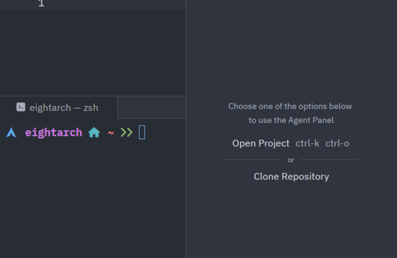

# TAU — The Artificial Ultimate

  <div align="center">


**A local-first, agentic coding IDE.** Forked from [Zed](https://zed.dev).

[](LICENSE-GPL)
[](rust-toolchain.toml)
[]()



</div>

> **Experimental.** TAU is a fork of Zed with an integrated AI agent. It works but expect rough edges.

## Quick Start

### Linux / macOS
```bash
curl -fsSL https://raw.githubusercontent.com/IkramRamadhan08/TAU-theArtificialUltimate/main/install.sh | bash
```

### Windows
```powershell
powershell -c "& { $(Invoke-WebRequest -Uri 'https://raw.githubusercontent.com/IkramRamadhan08/TAU-theArtificialUltimate/main/install.ps1' -UseBasicParsing).Content | Invoke-Expression }"
```

The script will:
- **Linux x86-64** → download pre-built binary
- **Windows x86-64** → download pre-built binary
- **macOS** → build from source (requires Rust, see [rustup.rs](https://rustup.rs))
- Ask about desktop shortcut
- Add to `PATH`

Then type `tau` — the terminal closes and TAU appears.

### Uninstall

**Linux / macOS:**
```bash
curl -fsSL https://raw.githubusercontent.com/IkramRamadhan08/TAU-theArtificialUltimate/main/uninstall.sh | bash
```

**Windows:**
```powershell
powershell -c "Remove-Item -Recurse -Force \"$env:LOCALAPPDATA\TAU\"; `$path = [Environment]::GetEnvironmentVariable('Path', 'User') -replace ';$env:LOCALAPPDATA\\TAU', ''; [Environment]::SetEnvironmentVariable('Path', `$path, 'User')"
```

## Pre-built Binaries

Pre-built binaries are built via GitHub Actions when a new tag is pushed.

| Platform | Asset |
|----------|-------|
| Linux x86-64 | ✅ Available |
| macOS x86-64 | ⚠️ GitHub Actions queue pending |
| macOS ARM | ❌ Blocked (webrtc-sys + Xcode 15.4) |
| Windows x86-64 | ✅ Available |

## Build from Source

Requires **Rust 1.95.0**:

```bash
git clone https://github.com/IkramRamadhan08/TAU-theArtificialUltimate.git
cd TAU_Project/editor
cargo run --release --bin tau
```

> **macOS**: Xcode Command Line Tools required (`xcode-select --install`).
> **Windows**: Visual Studio Build Tools with "Desktop development with C++" workload required.

## LLM Providers

Configure in `~/.config/tau/settings.json`:

```json
{
  "language_models": {
    "mistral": { "api_key": "...", "model": "mistral-small-latest" },
    "ollama": { "model": "codestral", "base_url": "http://localhost:11434" },
    "openai": { "api_key": "...", "model": "gpt-4o" }
  }
}
```

**Tested**: Mistral, Ollama, OpenAI. Other providers (Anthropic, Google, DeepSeek, xAI, OpenRouter, etc.) have code present but need real-world testing.

## Agent Features

- Built-in AI agent with tool execution (terminal, file ops, search, git, web)
- 14 built-in skills (brainstorming, TDD, debugging, code review, etc.)
- Circuit breaker (auto-backoff on API errors)
- Configurable request timeout (default 120s)
- Custom skills in `~/.agents/skills/`

## Limitations

- **TAU Cloud** (collaboration): not implemented
- **Auto-update**: checks GitHub Releases every 60 min; works for Linux & Windows
- **macOS ARM build**: blocked by `webrtc-sys` + Xcode 15.4 libc++ incompatibility
- **macOS x86-64 build**: GitHub Actions runner queue delay
- **Web search tool**: requires external API config

## License

Forked from [Zed](https://zed.dev). Original code GPL-3.0-or-later / Apache-2.0. TAU modifications GPL-3.0-or-later.

See [LICENSE-GPL](LICENSE-GPL) and [LICENSE-APACHE](LICENSE-APACHE).
