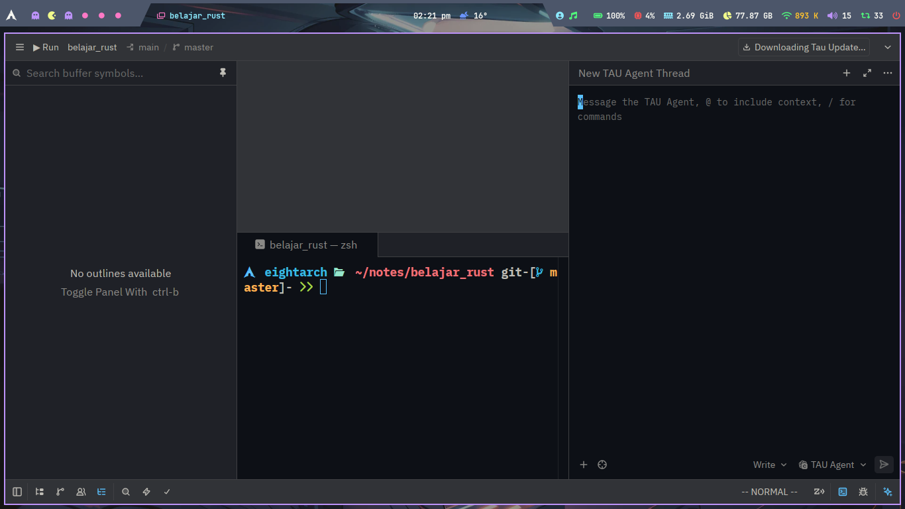

<div align="center">


# TAU — The Artificial Ultimate

**A local-first, agentic coding IDE with integrated AI.**

[](LICENSE-GPL)
[](rust-toolchain.toml)
[](https://github.com/IkramRamadhan08/TAU-theArtificialUltimate/releases)
[](https://github.com/IkramRamadhan08/TAU-theArtificialUltimate/actions)
[](https://github.com/IkramRamadhan08/TAU-theArtificialUltimate/releases)

</div>

<br>

> **Experimental.** TAU is a Rust-based IDE with a deeply integrated AI agent that writes code, runs commands, edits files, and builds projects — all from natural language. All AI features run through your own LLM provider API keys. No cloud dependency. No telemetry. Expect rough edges.

---

## IDE Preview

<div align="center">
  
</div>

---

## Table of Contents

- [Features](#features)
- [Quick Start](#quick-start)
- [Pre-built Binaries](#pre-built-binaries)
- [Build from Source](#build-from-source)
- [Configure LLM Providers](#configure-llm-providers)
- [Agent Overview](#agent-overview)
- [Keyboard Shortcuts](#keyboard-shortcuts)
- [Project Structure](#project-structure)
- [FAQ](#faq)
- [Contributing](#contributing)
- [License](#license)

---

## Features

### AI Agent

| Capability | Description |
|---|---|
| **Code generation** | Build apps, components, and scripts from natural language |
| **Multi-file editing** | Edit any file in your project simultaneously |
| **Terminal integration** | Run commands, install deps, build, test — all through the agent |
| **Code search** | Regex grep, semantic search, go-to-definition, find references |
| **Git integration** | Status, commit, push, branch, log — full git workflow |
| **Web research** | Search web, fetch URLs, read documentation |
| **Plans & verification** | Structured plans with automated verification gates |
| **Sub-agents** | Spawn parallel agents for independent tasks |
| **14 built-in skills** | Brainstorming, TDD, debugging, code review, and more |
| **Custom skills** | Write your own reusable agent instructions |

### Editor

| Capability | Description |
|---|---|
| **Multi-cursor editing** | Vim mode, column selection, multiple cursors |
| **LSP integration** | Go-to-definition, completions, diagnostics, hover, rename |
| **Built-in terminal** | Integrated shell with inline AI assistant |
| **Git panel** | Diff viewer, staging, blame, inline git status |
| **Command palette** | Fuzzy-find any action |
| **File explorer** | Project tree with git status decorations |
| **Syntax highlighting** | Tree-sitter for 100+ languages |
| **Multi-buffer search** | Search across entire project with live preview |
| **Edit prediction** | AI-powered inline code suggestions (Mistral, Codestral, Mercury) |
| **Themes** | Dark and light themes included |
| **Extensions** | WASM-based extension system |

### Local-First

| Capability | Description |
|---|---|
| **No cloud dependency** | All AI features use your own API keys |
| **No telemetry** | Zero data collection |
| **No account required** | No sign-up, no login |
| **Offline-capable editor** | Full editor functionality without internet |
| **Local provider support** | Ollama, LM Studio for fully offline AI |

---

## Quick Start

### Linux / macOS

```bash
curl -fsSL https://raw.githubusercontent.com/IkramRamadhan08/TAU-theArtificialUltimate/main/editor/script/install.sh | bash
```

### Windows (PowerShell)

```powershell
powershell -c "& { $(Invoke-WebRequest -Uri 'https://raw.githubusercontent.com/IkramRamadhan08/TAU-theArtificialUltimate/main/editor/script/install.ps1' -UseBasicParsing).Content | Invoke-Expression }"
```

**What the installer does:**

1. Detects your OS and architecture (x86_64 / ARM64)
2. Downloads the latest pre-built binary from GitHub Releases
3. Installs to `~/.local/bin` (Linux/macOS) or `%LOCALAPPDATA%\TAU` (Windows)
4. Adds TAU to your `PATH`
5. On Linux, installs system dependencies automatically (X11, Wayland, audio libs)
6. Creates desktop shortcut and Start Menu entry (Windows)
7. Registers file associations and `tau://` URI handler (Windows)

**After installation, type `tau` in your terminal or click the desktop shortcut.**

### Uninstall

**Linux / macOS:**

```bash
curl -fsSL https://raw.githubusercontent.com/IkramRamadhan08/TAU-theArtificialUltimate/main/editor/script/uninstall.sh | bash
```

**Windows (PowerShell):**

```powershell
powershell -c "Remove-Item -Recurse -Force \"$env:LOCALAPPDATA\TAU\"; $path = [Environment]::GetEnvironmentVariable('Path', 'User') -replace ';$env:LOCALAPPDATA\\TAU', ''; [Environment]::SetEnvironmentVariable('Path', $path, 'User')"
```

---

## Pre-built Binaries

Binaries are built automatically via GitHub Actions when a new tag is pushed.

| Platform | Architecture | Status |
|---|---|---|
| Linux | x86-64 | ✅ Available |
| macOS | ARM64 (Apple Silicon) | ✅ Available |
| Windows | x86-64 | ✅ Available |

> **macOS Intel (x86-64):** Not currently distributed as a pre-built binary. Run the install script to build from source, or use Rosetta 2 with the ARM64 build.

---

## Build from Source

Requires **Rust 1.85.0** ([rustup.rs](https://rustup.rs)):

```bash
git clone https://github.com/IkramRamadhan08/TAU-theArtificialUltimate.git
cd TAU-theArtificialUltimate/editor
cargo run --release --bin tau
```

> **macOS:** Xcode Command Line Tools required (`xcode-select --install`).
> **Windows:** Visual Studio Build Tools with the "Desktop development with C++" workload.
> **Linux:** System deps listed in [.github/workflows/release.yml](.github/workflows/release.yml).

### Run Tests

```bash
cd editor
cargo test --release
```

---

## Configure LLM Providers

TAU supports multiple LLM providers. Configure them via the UI (**Settings → Language Models**) or directly in `~/.config/tau/settings.json`.

### Minimal Setup (Mistral)

```json
{
  "language_models": {
    "mistral": {
      "api_key": "YOUR_API_KEY",
      "model": "mistral-small-latest"
    }
  }
}
```

### All Supported Providers

```json
{
  "language_models": {
    "openai": {
      "api_key": "sk-...",
      "model": "gpt-4o"
    },
    "anthropic": {
      "api_key": "sk-ant-...",
      "model": "claude-sonnet-4-20250514"
    },
    "mistral": {
      "api_key": "...",
      "model": "mistral-small-latest"
    },
    "google": {
      "api_key": "...",
      "model": "gemini-2.0-flash"
    },
    "ollama": {
      "model": "codestral",
      "base_url": "http://localhost:11434"
    },
    "openrouter": {
      "api_key": "...",
      "model": "anthropic/claude-sonnet-4"
    },
    "deepseek": {
      "api_key": "...",
      "model": "deepseek-coder"
    },
    "xai": {
      "api_key": "...",
      "model": "grok-2"
    },
    "lm_studio": {
      "base_url": "http://localhost:1234/v1",
      "model": "local-model"
    }
  }
}
```

**Tested providers:** Mistral, Ollama, OpenAI, Anthropic, Google.

**Available but community-tested:** DeepSeek, xAI (Grok), OpenRouter, LM Studio, Vercel AI Gateway.

---

## Agent Overview

### Agent Profiles

Define agent behavior profiles in settings:

```json
{
  "agent": {
    "profiles": {
      "default": {
        "enabled": true,
        "model": {
          "provider": "mistral",
          "model": "mistral-small-latest"
        },
        "tools": {
          "terminal": true,
          "read_file": true,
          "write_file": true,
          "edit_file": true,
          "grep": true,
          "web_search": false,
          "git_commit": true
        }
      }
    }
  }
}
```

### Built-in Agent Skills

| Skill | Description |
|---|---|
| **brainstorming** | Creative design, features, and architecture exploration |
| **test-driven-development** | Write tests before implementation code |
| **systematic-debugging** | Structured bug investigation and fix workflow |
| **dispatching-parallel-agents** | Split independent tasks across sub-agents |
| **subagent-driven-development** | Execute implementation plans with sub-agents |
| **writing-plans** | Create detailed implementation plans from requirements |
| **executing-plans** | Execute plans with review checkpoints |
| **verification-before-completion** | Verify correctness before claiming completion |
| **requesting-code-review** | Request thorough code review before merging |
| **receiving-code-review** | Process review feedback with technical rigor |
| **finishing-a-development-branch** | Complete and integrate finished work |
| **using-git-worktrees** | Create isolated workspaces via git worktrees |
| **writing-skills** | Create, edit, and verify custom agent skills |
| **create-skill** | Package reusable agent instructions as skills |

### Custom Skills

Create your own skills in `~/.agents/skills/`:

```
~/.agents/skills/
├── my-workflow/
│   ├── SKILL.md         # Instructions for the agent
│   └── script.sh         # Optional helper script
└── deploy-check/
    └── SKILL.md
```

---

## Keyboard Shortcuts

### AI Agent

| Action | Linux / Windows | macOS |
|---|---|---|
| Open AI panel | `Ctrl+Shift+A` | `Cmd+Shift+A` |
| Inline assistant | `Ctrl+I` | `Cmd+I` |
| Accept suggestion | `Tab` | `Tab` |
| Reject suggestion | `Escape` | `Escape` |

### Editor

| Action | Linux / Windows | macOS |
|---|---|---|
| Command palette | `Ctrl+Shift+P` | `Cmd+Shift+P` |
| File finder | `Ctrl+P` | `Cmd+P` |
| Find in project | `Ctrl+Shift+F` | `Cmd+Shift+F` |
| Go to definition | `F12` | `F12` |
| Toggle terminal | `Ctrl+`` | `Cmd+`` |
| Toggle file explorer | `Ctrl+Shift+E` | `Cmd+Shift+E` |
| Toggle git panel | `Ctrl+Shift+G` | `Cmd+Shift+G` |

---

## Project Structure

```
TAU-theArtificialUltimate/
├── editor/                          # Main editor workspace (Rust)
│   ├── crates/                      # 230+ crates
│   │   ├── agent/                   # AI agent core (planning, tool execution)
│   │   ├── agent_skills/            # Built-in skills and skill system
│   │   ├── agent_settings/          # Agent configuration schema
│   │   ├── agent_ui/                # Agent chat panel UI
│   │   ├── gpui/                    # GPU-accelerated UI framework
│   │   ├── language/                # Language and Tree-sitter integration
│   │   ├── project/                 # Project and worktree management
│   │   ├── terminal/                # Integrated terminal emulator
│   │   ├── terminal_view/           # Terminal panel with inline AI
│   │   ├── lsp/                     # LSP client
│   │   ├── edit_prediction_ui/      # AI inline code suggestions
│   │   ├── anthropic/               # Anthropic API provider
│   │   ├── openai/                  # OpenAI API provider
│   │   ├── ollama/                  # Ollama provider
│   │   ├── google_ai/               # Google AI provider
│   │   └── ...                      # 220+ additional crates
│   ├── docs/                        # Documentation
│   └── assets/                      # Themes, icons, images, sounds
├── editor/script/install.sh         # Linux/macOS installer
├── editor/script/install.ps1        # Windows installer
├── editor/script/uninstall.sh       # Linux/macOS uninstaller
├── editor/assets/images/tau-icon.png # Project logo
└── README.md
```

---

## FAQ

**Do I need an account?** No. TAU has no accounts, no sign-in, no cloud service.

**Does TAU collect telemetry?** No. Zero data collection. No crash reporting. No analytics.

**Can I use TAU offline?** The editor is fully offline. AI features require API access to your LLM provider, except when using local providers like Ollama or LM Studio.

**How do I get an API key?** Sign up with any supported provider (Mistral, OpenAI, Anthropic, Google, etc.) and paste the key in Settings → Language Models.

---

## Contributing

All contributions are welcome! See [CONTRIBUTING.md](CONTRIBUTING.md) for the full guide.

**Ways to contribute:**

- 🐛 Report bugs via [GitHub Issues](https://github.com/IkramRamadhan08/TAU-theArtificialUltimate/issues)
- 💡 Suggest features and improvements
- 🔧 Submit pull requests for bug fixes and features
- 📝 Improve documentation and guides
- 🌐 Create extensions and themes
- 🧪 Test TAU with different LLM providers and setups

---

## License

TAU is licensed under GPL-3.0-or-later. See [LICENSE-GPL](LICENSE-GPL).

---

<div align="center">
Built with ❤️ by the TAU community.
</div>
